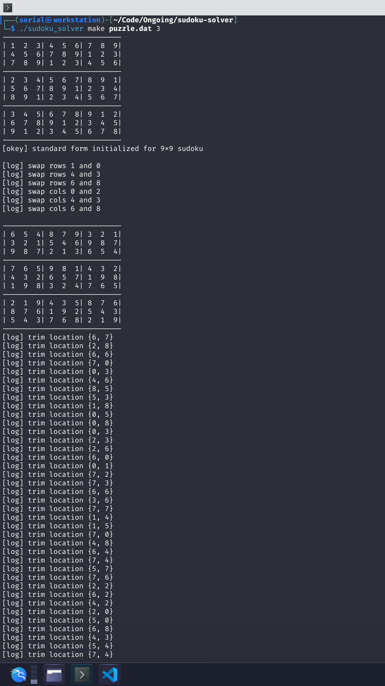
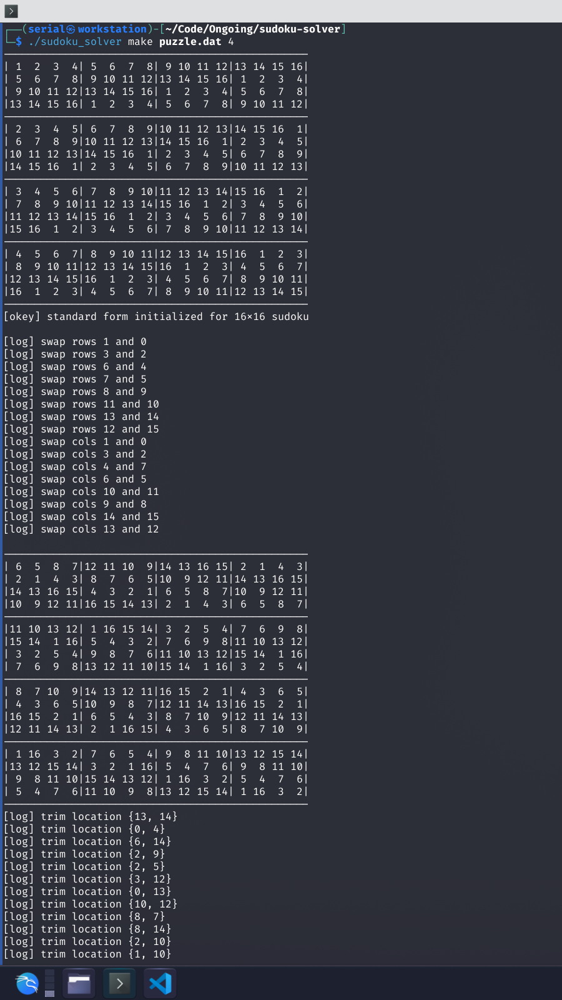
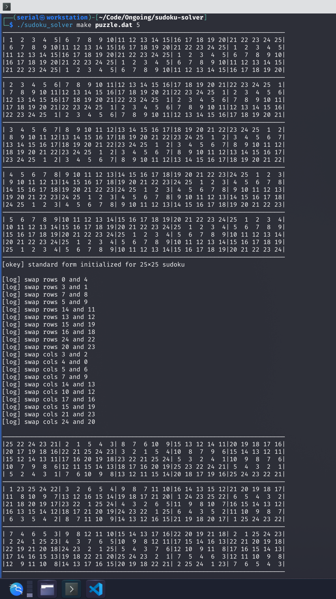
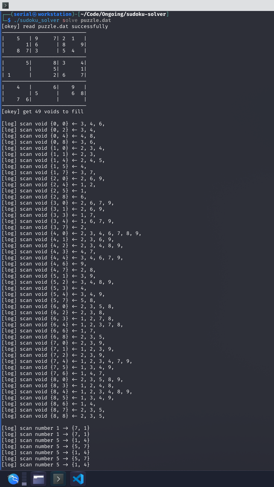
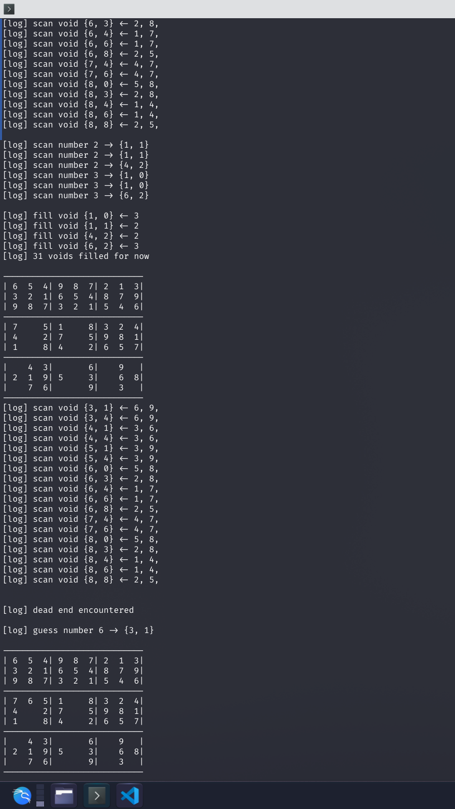
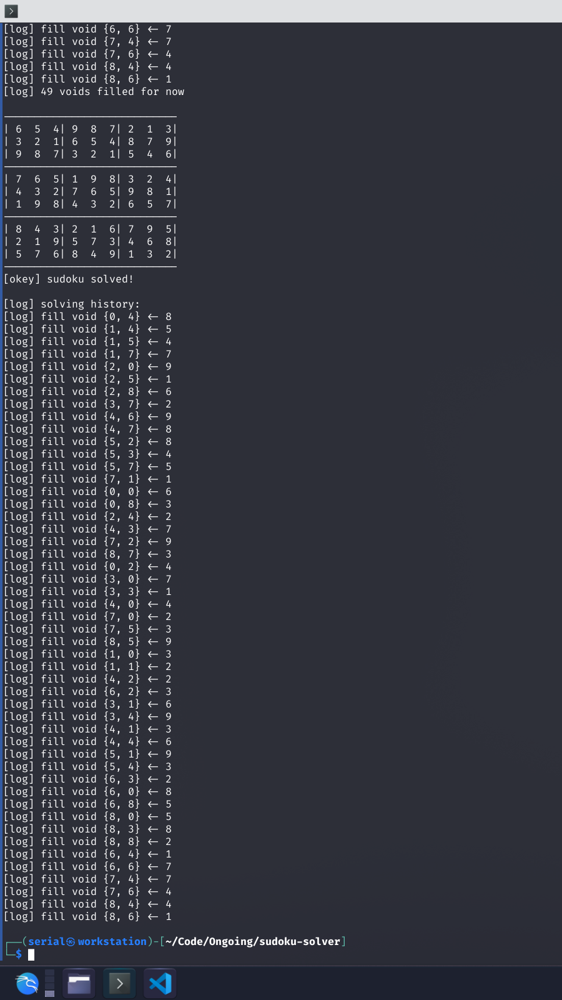

# sudoku maker

Steps for making a sudoku puzzle
- initialize a standard map of order-N sudoku
- swap whole rows and cols for every chunk randomly
- trim the map randomly

Standard map defined for order-3 9x9 sudoku

| | | | | | | | | |
|-|-|-|-|-|-|-|-|-|
|1|2|3|4|5|6|7|8|9|
|4|5|6|7|8|9|1|2|3|
|7|8|9|1|2|3|4|5|6|
|2|3|4|5|6|7|8|9|1|
|5|6|7|8|9|1|2|3|4|
|8|9|1|2|3|4|5|6|7|
|3|4|5|6|7|8|9|1|2|
|6|7|8|9|1|2|3|4|5|
|9|1|2|3|4|5|6|7|8|
| | | | | | | | | |

Screenshots

# sudoku solver

Steps for solving a sudoku puzzle
- scan every void in puzzle map and check what can put in it
- scan every number in puzzle scale and check where can put it in
- fill the logically available numbers which are absolutely right
- if dead end, guess a number
- if error, withdraw guess and make a new one

Screenshots

